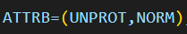

# BMS

BMS is a language to define screens in CICS applications. It employs macros to define visual components.

For more information, you can visit the IBM official documentation at: [ibm documentation](https://www.ibm.com/docs/en/cics-ts/6.1?topic=development-bms-macros)

Next is a brief and inaccurate description of the language.

## Macros

- DFHMDF: A field. These components are the labels and inputs you can interact with.
- DFHMDI: A map. This macro represents a single screen.
- DFHMSD: A mapset. May be called file in this extension. This macro represent a collection of screens.
- DFHPDI: A partition.
- DFHPSD: A partition set. It is a collection of partitions.

## Field types
- Label Field: A label field is a field that displays information or descriptive text on a screen or form. It is usually not interactive and is commonly used to provide instructions or titles in a user interface.
The label atribute is: 

- Input Field: An input field is an interactive field that allows the user to enter data, such as numbers or text. These fields are commonly used to collect user information.
The input atribute is: 

- Numeric Field: A numeric field is a specific type of input field that only allows the entry of numbers. It is often used to gather numerical data, such as quantities or values.
The numeric atribute is: 

- Password Field: A password field is similar to an input field but hides the entered characters to protect user privacy. It is used to collect passwords or other confidential information.
The password atribute is: 

- Message Field: A message field is a component that displays information to the user, such as error messages, confirmations, or notifications. It is not interactive and is used to communicate important information.
The message atribute is:  

- Output Field: An output field displays information or data on a screen or form but does not allow input or modification by the user. It is often used to display results or static information.
The output atribute is: 

## Rules

- Each partition set definition contains a single DFHPSD macro followed by one or more DFHPDI macros, and ending with a DFHPSD TYPE=FINAL partition set definition macro.
- Map set, map, and field definition: Ensure that the names of maps, and names of fields within a map set (or within multiple map sets that are copied into one application program) are unique. However, a map can have the same name as a map set.
- Partition set definition: Partitions are defined by coding the macros DFHPSD (partition set definition) and DFHPDI (partition definition). Each partition definition must be part of a partition set definition.