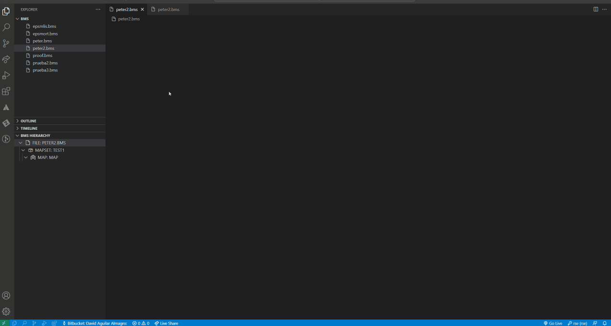

# Index
- [Index](#index)
- [Introduction](#introduction)
	- [Create mapset and map ](#create-mapset-and-map-)
	- [Create new label field ](#create-new-label-field-)
	- [Create new input field ](#create-new-input-field-)
	- [Create new numeric field ](#create-new-numeric-field-)
	- [Create new password field ](#create-new-password-field-)
	- [Create new message field ](#create-new-message-field-)
	- [Create new output field ](#create-new-output-field-)
	- [Editing macros ](#editing-macros-)
		- [Editing fields ](#editing-fields-)
			- [Move a field ](#move-a-field-)
			- [Resize a field ](#resize-a-field-)
		- [Editing map ](#editing-map-)
		- [Editing map set ](#editing-map-set-)
		- [Editing partition ](#editing-partition-)
		- [Editing partition set ](#editing-partition-set-)
	- [Delete field ](#delete-field-)

# Introduction

The design view enables editing BMS CICS files in a visual and guided way. It's particular features are showed in the following sections.

## Create mapset and map 

Prerequisite: Open or create a new .bms file within BMS Designer extension.

1. Right-click on canvas.
2. Click on create mapset and map.
3. Write the name to mapset and map.

## Create new label field 

Prerequisite: Open a .bms file within BMS Designer extension with a valid mapset and map on it.

1. Right-click on canvas.
2. Click on create new label field.
3. Write the name to the new label field.

Note:
1. The label field doesn't create a special 'askip' field with it
## Create new input field 

Prerequisite: Open a .bms file within BMS Designer extension with a valid mapset and map on it.

1. Right-click on canvas.
2. Click on create new input field.
3. Write the name to the new input field.

Note:
1. The input field create a special 'askip' field with it
## Create new numeric field 

Prerequisite: Open a .bms file within BMS Designer extension with a valid mapset and map on it.

1. Right-click on canvas.
2. Click on create new numeric field.
3. Write the name to the new numeric field.

Note:
1. The numeric field create a special 'askip' field with it

## Create new password field 

Prerequisite: Open a .bms file within BMS Designer extension with a valid mapset and map on it.

1. Right-click on canvas.
2. Click on create new password field.
3. Write the name to the new password field.

Note:
1. The password field create a special 'askip' field with it

## Create new message field 

Prerequisite: Open a .bms file within BMS Designer extension with a valid mapset and map on it.

1. Right-click on canvas.
2. Click on create new message field.
3. Write the name to the new message field.

Note:
1. The message field doesn't create a special 'askip' field with it
## Create new output field 

Prerequisite: Open a .bms file within BMS Designer extension with a valid mapset and map on it.

1. Right-click on canvas.
2. Click on create new output field.
3. Write the name to the new output field.

Note:
1. The output field doesn't create a special 'askip' field with it
## Editing macros 

Note: From canvas you just can open fields, but with desing view opened and the tree, you could open every macro.

### Editing fields 

1. Double click on a field to open it

Note: The attributes of the field macro have some restrictions following the IBM rules from this macro. To get more info follow this <a href="https://www.ibm.com/docs/en/cics-ts/6.1?topic=macros-dfhmdf">link</a>

#### Move a field 
Note:
1. Some DFHMDF macros also create a special field with the 'askip' attribute; this field moves together with the creator field

1. Click and hold over a field.
2. Drag the field to the chosen position.
3. Release the mouse button.

Notes: 
1. If a DFHMDF macro tries to move to a position where another DFHMDF macro is located(with a margin of +1 on the left and right) or attempts to move out of the canvas, a warning message will be displayed and movement will be prevented.
2. The DFHMDF macro with the 'askip' attribute may collide with another field or move out of the canvas

#### Resize a field 
Note:
1. Some DFHMDF macros also create a special field with the 'askip' attribute; this field moves together with the creator field

1. Click and hold over the right side of the field.
2. Increase or decrease the size of the field.
3. Release the mouse button.

Notes: 
1. If a DFHMDF macro tries to resize to a position where another DFHMDF macro is located(with a margin of +1 on the left and right) , a warning message will be displayed and resize will be prevented.
2. The DFHMDF macro with the 'askip' attribute may collide with another field.
3. If a  DFHMDF macro tries to resize on the right boder of the canvas, it will stop at the border.

### Editing map 

1. Open the tree view.
2. Right-click on a map reference.
3. Click on edit macro.

Note: The attributes of the field macro have some restrictions following the IBM rules from this macro. To get more info follow this <a href="https://www.ibm.com/docs/en/cics-ts/6.1?topic=macros-dfhmdi">link</a>

### Editing map set 

1. Open the tree view.
2. Right-click on a mapset reference.
3. Click on edit macro.

Note: The attributes of the field macro have some restrictions following the IBM rules from this macro. To get more info follow this <a href="https://www.ibm.com/docs/en/cics-ts/6.1?topic=macros-dfhmsd">link</a>

### Editing partition 

1. Open the tree view.
2. Right-click on a partition reference.
3. Click on edit macro.

Note: The attributes of the field macro have some restrictions following the IBM rules from this macro. To get more info follow this <a href="https://www.ibm.com/docs/en/cics-ts/6.1?topic=macros-dfhpdi">link</a>

### Editing partition set 

1. Open the tree view.
2. Right-click on a partitionset reference.
3. Click on edit macro.

Note: The attributes of the field macro have some restrictions following the IBM rules from this macro. To get more info follow this <a href="https://www.ibm.com/docs/en/cics-ts/6.1?topic=macros-dfhpsd">link</a>

## Delete field 

Prerequisite: A field (DFHMDF macro) must be exist.

Note:
1. If the DFHMDF macro creates another field with "askip" atribute, it will also be deleted 

- Delete a DFHMDF macro without another DFHMDF macro with 'askip'

1. Right-click on a field.
2. Click on delete field.

- Delete a DFHMDF macro with another DFHMDF macro with 'askip'

1. Right-click on a field.
2. Click on delete field.

