# Index
- [Index](#index)
- [Introduction](#introduction)
	- [Open the TreeView](#open-the-treeview)
	- [Tabs view](#tabs-view)
	- [Deploy nodes](#deploy-nodes)
	- [Comments](#comments)
	- [Node Actions](#node-actions)
	- [File node](#file-node)
	- [DFHPSD node](#dfhpsd-node)
	- [DFHPDI node](#dfhpdi-node)
	- [DFHMSD node](#dfhmsd-node)
	- [DFHMDI node](#dfhmdi-node)
	- [DFHMDF node](#dfhmdf-node)

# Introduction

The extension adds a tree view for the BMS hierachy that enables multiple actions.

## Open the TreeView 

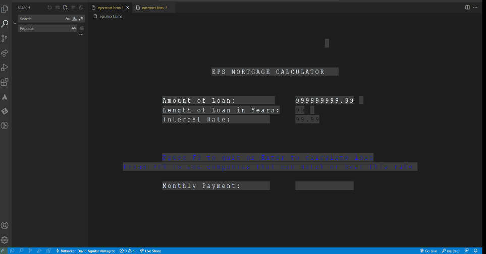

Prerequisite: Having a .bms opened.

1. Click on the "Explorer" tab in the Sidebar
2. The "MY TREE VIEW" container will display the hierarchical tree

## Tabs view 

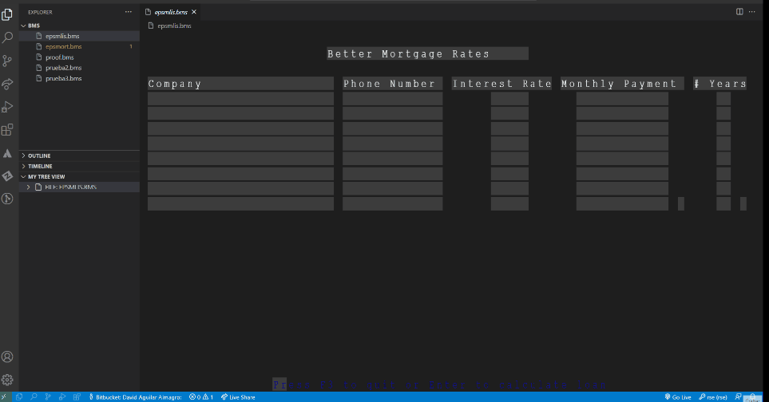

1. Click on the "Source" tab to switch to source mode if the view remains in design mode.
2. Click on the "Design" tab to switch to design mode if the view remains in source mode.

## Deploy nodes 

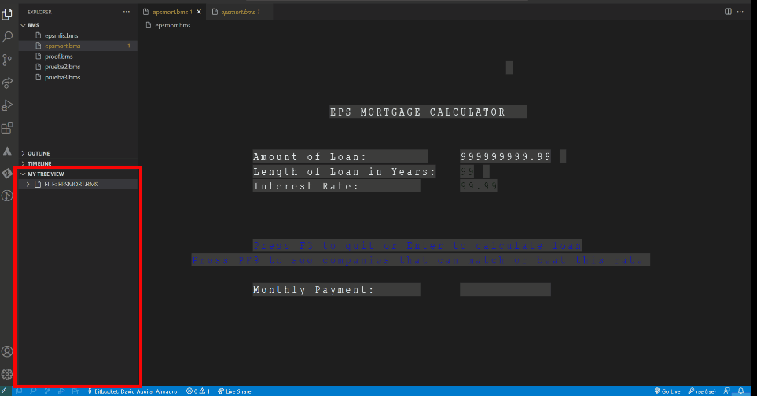

Prerequisite: The node must have children in order to be deployed.

1. Click on the node to deploy its child nodes.
2. Click again on the parent node to collapse the child nodes.

## Comments 

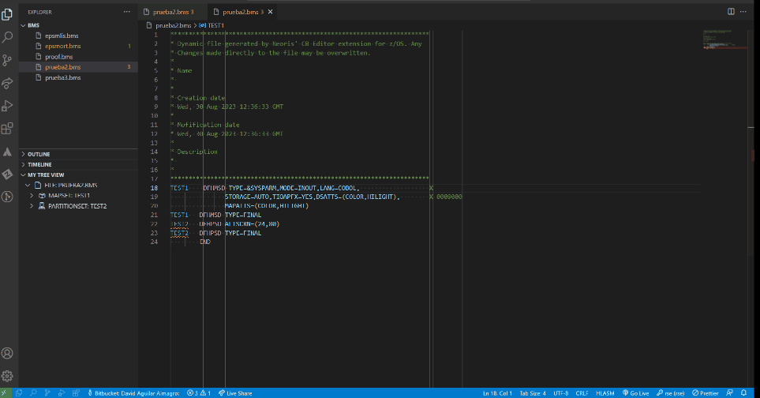

1. Right-click on the node(except file node) and click "Add comment"
2. Enter the comment in the QuickPick menu

Notes:
1. If a node has comment(s), a "(c)" will apear to it's right
2. To view the comments in design mode, place the cursor on a node, the comments will apear in an emergent menu
3. In the source mode, the commens  will be placed above the selected node.
4. When adding a map set or a partition set to a file, a header comment will be included, providing information about the date and extension.

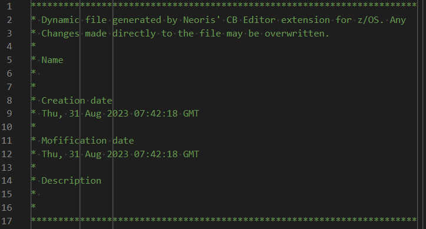

## Node Actions 

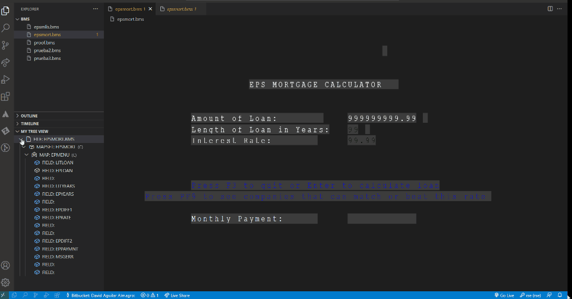

Info: For each node, we will have specific actions corresponding to the functionality associated with each macro.

1. Click righ buttom on the node to display the menu.
2. Double-click on the node to edit the macro. (File nodes do not have this feature.).To learn more about this feature, refer to the   [Edit macro section](designview.MD/#edit-macro)

Note:The double-click feature in source mode will place the cursor on that macro.

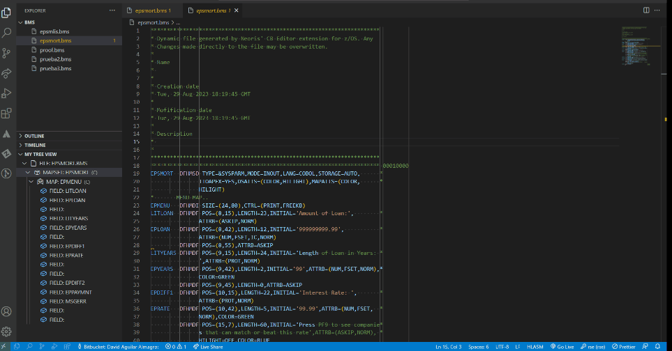

## File node 

The file node is represented by this icon: 
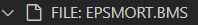

The file node actions are as follows:

- Add map set

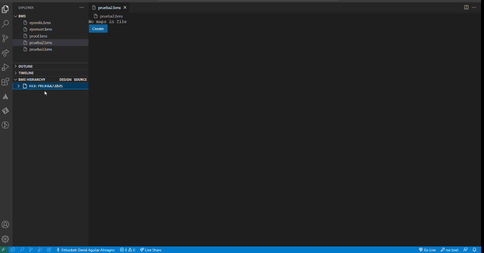

1. Click right buttom on the node and select "Add map set"
2. If the view design mode is selected, we have to introduce a valid name for the map set .

Notes:
1. If a map set already exists, it will prevent the addition of a new one.
2. Add a map with same name.

- Add partition set

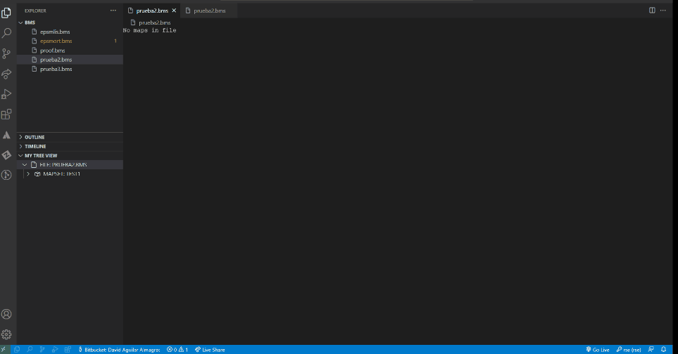

1. Click right buttom on the node and select "Add partition set"
2. If the view design mode is selected, we have to introduce a valid name for the partition set.

Note: If a partition set already exists, it will prevent the addition of a new one.

## DFHPSD node 
The dfhpsd node is represented by this icon:
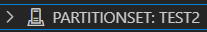

The dfhpsd node actions are as follows:

- Edit macro

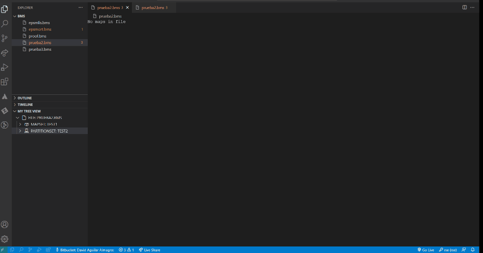

1. Click right buttom on the node and select "Edit macro"

Note: 
1. This feature is common for all nodes (except the file node) and functions the same as double-clicking on the node.

- Delete partition set
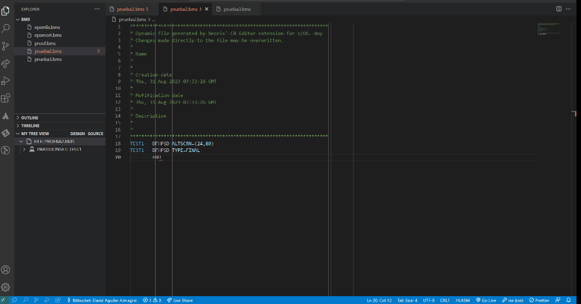

1. Click right buttom on the node and select "Delete partition set"

Note:
1. As a hierarchical type, all the child nodes (dfhpdi, comments) will also be deleted.
2. If a map set does not exist, the header will also be deleted along with the partition set

## DFHPDI node 
The dfhpdi node is represented by:
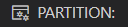

The dfhpdi node actions are as follows:

-Delete partition
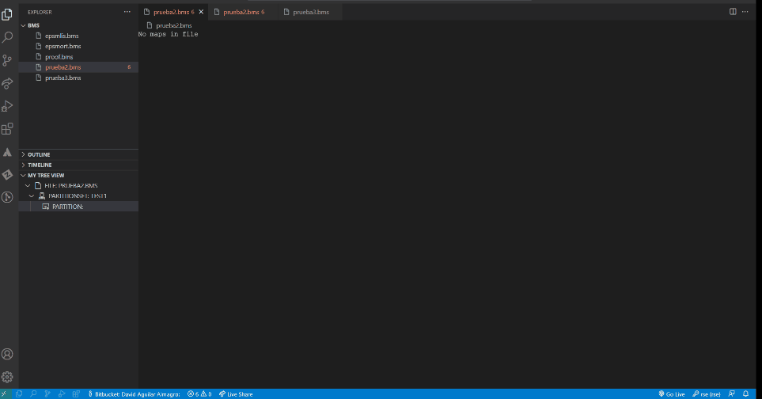

1. Click right buttom on the node and select "Delete partition"

Note:
1. When you add a partition to a partition set, it will be placed between the partition sets, as can be observed in the source mode.

## DFHMSD node 

The dfhmsd node is represented by this icon:
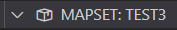

The dfhmsd node actions are as follow

- Add map
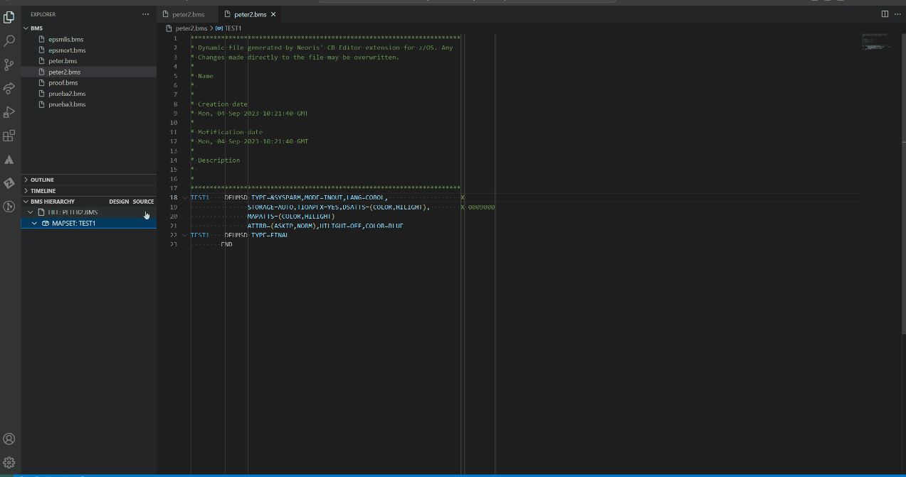

1. Click right buttom on the node and select "Add map"
2. Introduce a name for the map in the QuickPick menu and press enter to accept

Notes:
1. Similar to partitions, maps will also be included in the source mode between the map set.
2. In design mode, the 'No maps in file' message will disappear once a map is included
3. Multiple maps can be addded to a map set.

- Delete map set
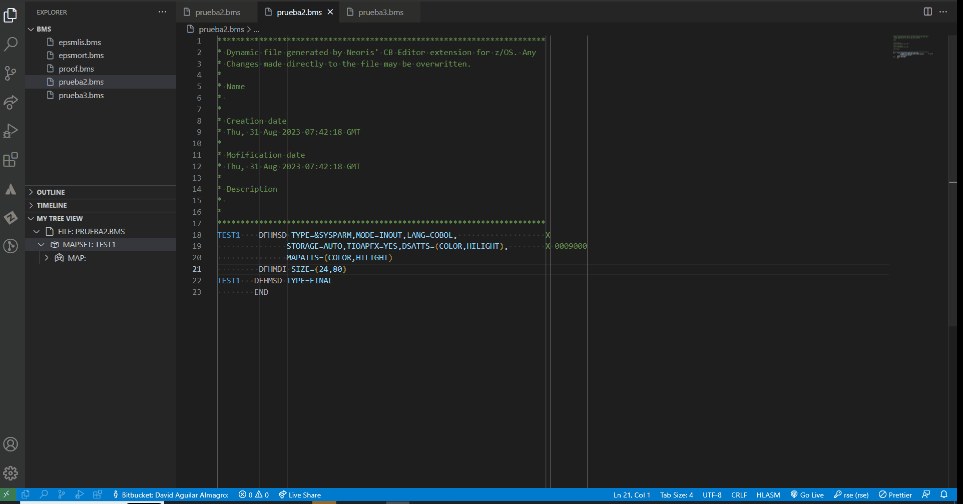

1. Click right buttom on the node and select "Delete map set".

Notes:
1. As a hierarchical type, all the child nodes (dfhmdi,dfhmdf comments) will also be deleted.
2. If a partition set does not exist, the header will also be deleted along with the map set

## DFHMDI node 

The dfhmdi node is represented by this icon:
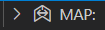

Notes:
1. The DFHMDF macros, has different structures that are defined by their attributes. Additionally, some of these fields create a special field with the 'askip' attribute, which cannot be modified but can be moved or deleted using the special field next to which it has been created.

The DFHMDF macro with "askip" atribute is represented by this icon:
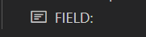

The dfhmdi node actions are as follow

- Add Label
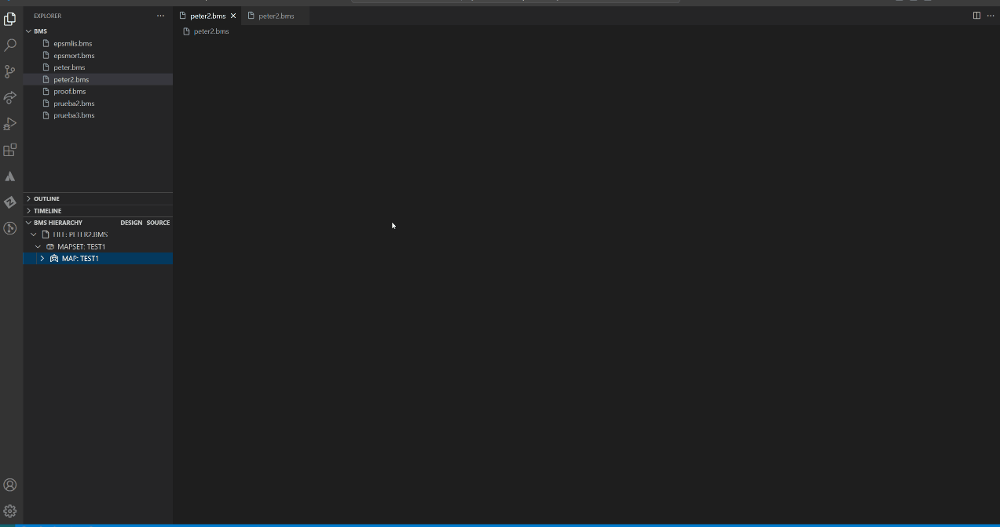

1. Click right on the map buttom and select "Add label field"
2. Introduce a name for the label in the QuickPick menu and press enter to accept.

Note:
1. The label field doesn't create a special 'askip' field with it

- Add Input
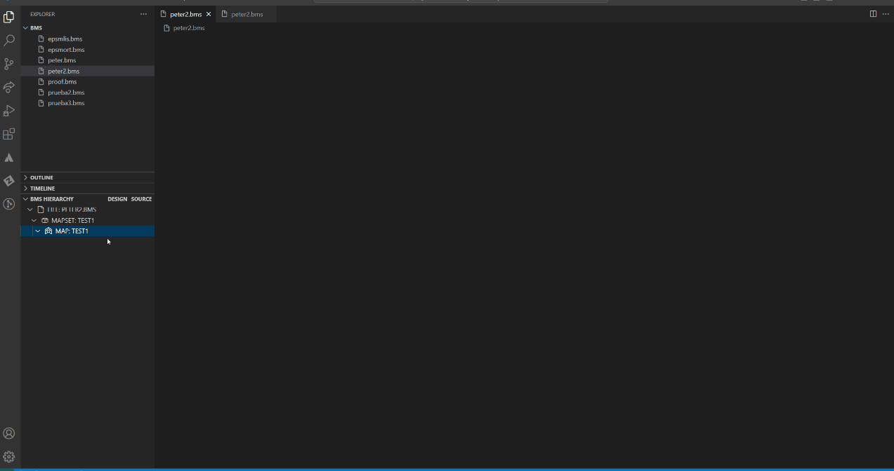

1. Click right on the map buttom and select "Add input field"
2. Introduce a name for the input in the QuickPick menu and press enter to accept.

Note:
1. The input field create a special 'askip' field with it

-  Add numeric field
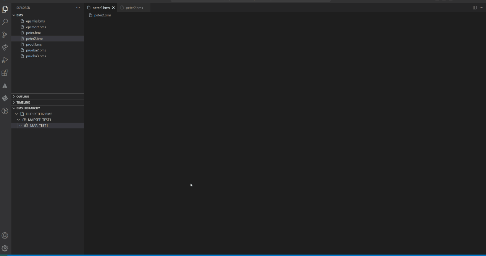

1. Click right on the map buttom and select "Add numeric field"
2. Introduce a name for the numeric in the QuickPick menu and press enter to accept.

Note:
1. The numeric field create a special 'askip' field with it

- Add password field
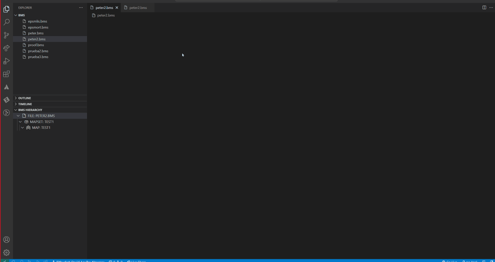

1. Click right on the map buttom and select "Add password field"
2. Introduce a name for the password in the QuickPick menu and press enter to accept.

Note:
1. The password field create a special 'askip' field with it

- Add message field
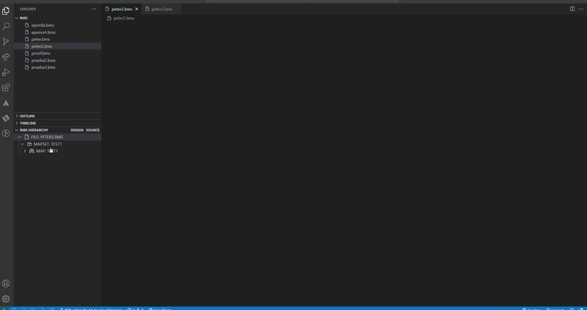

1. Click right on the map buttom and select "Add message field"
2. Introduce a name for the message in the QuickPick menu and press enter to accept.

Note:
1. The label message doesn't create a special 'askip' field with it

- Add output field

1. Click right on the map buttom and select "Add output field"
2. Introduce a name for the output in the QuickPick menu and press enter to accept.

Note:
1. The label output doesn't create a special 'askip' field with it

- Delete map
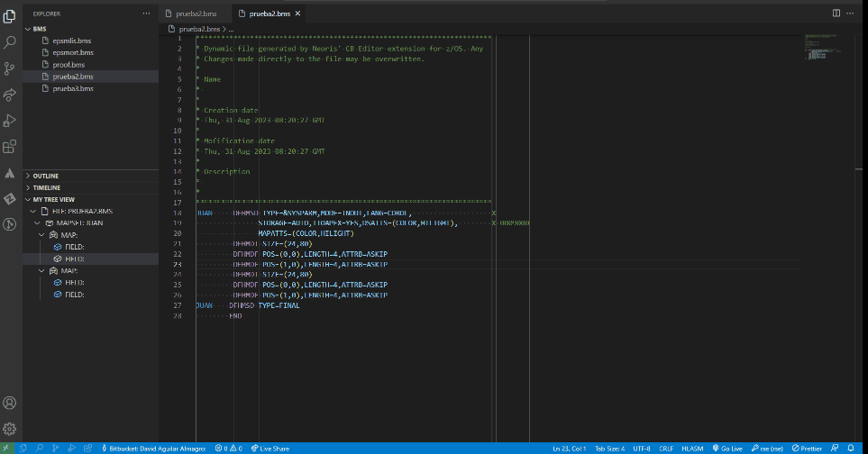

1. Click right on the node buttom and select "Delete map"

Note:
1. As a hierarchical type, all the child nodes (dfhmdf comments) will also be deleted

## DFHMDF node 
The dfhmdi node is represented by this icon:
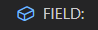

The dfhmdi node actions are as follow

- Delete a DFHMDF macro with another DFHMDF macro with 'askip'

Note:
1. If the DFHMDF macro creates another field with "askip" atribute, it will also be deleted 

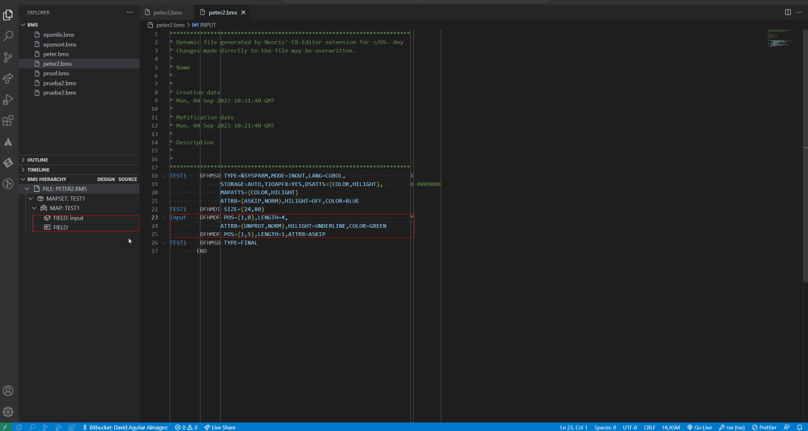

1. Click right on the node buttom and select "Delete field"

 - Delete a DFHMDF macro without another DFHMDF macro with 'askip'

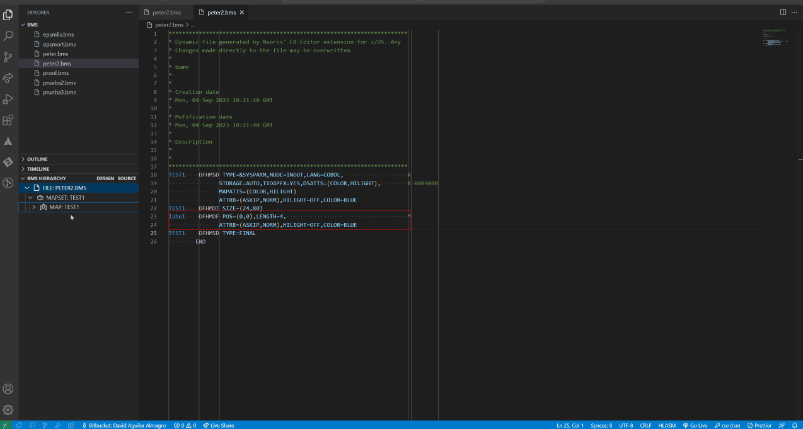

- 
